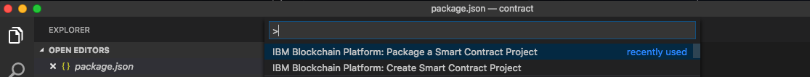
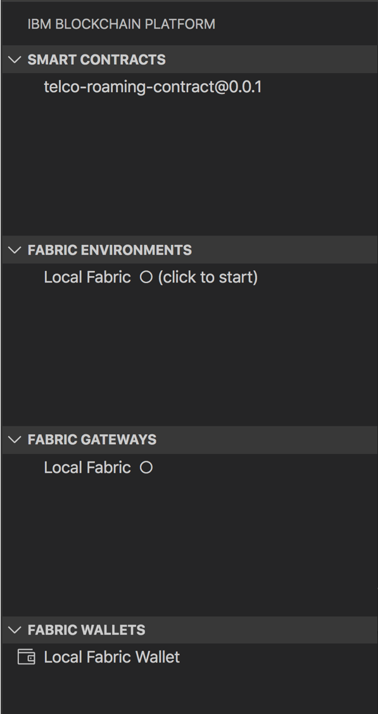
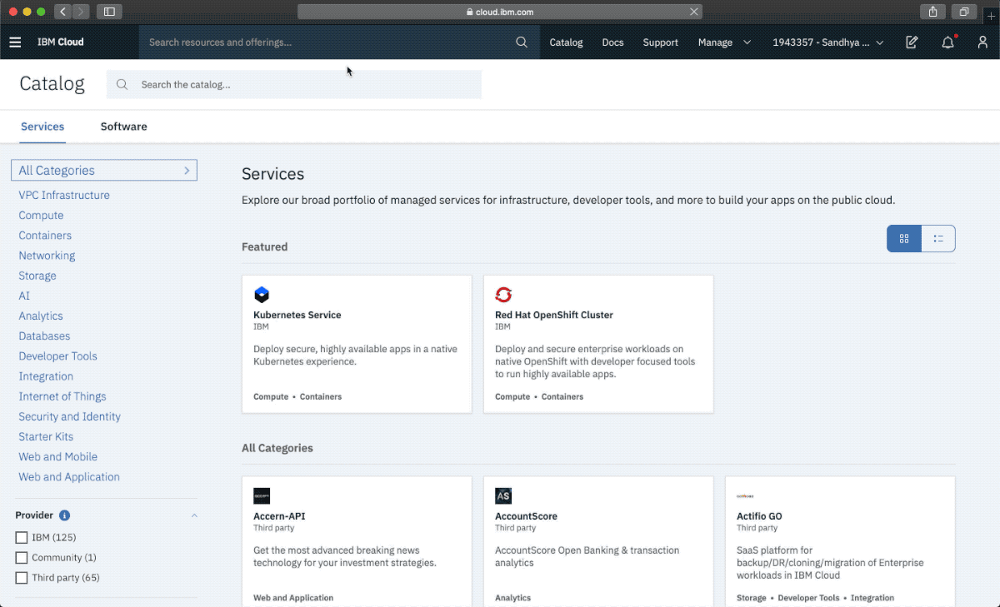
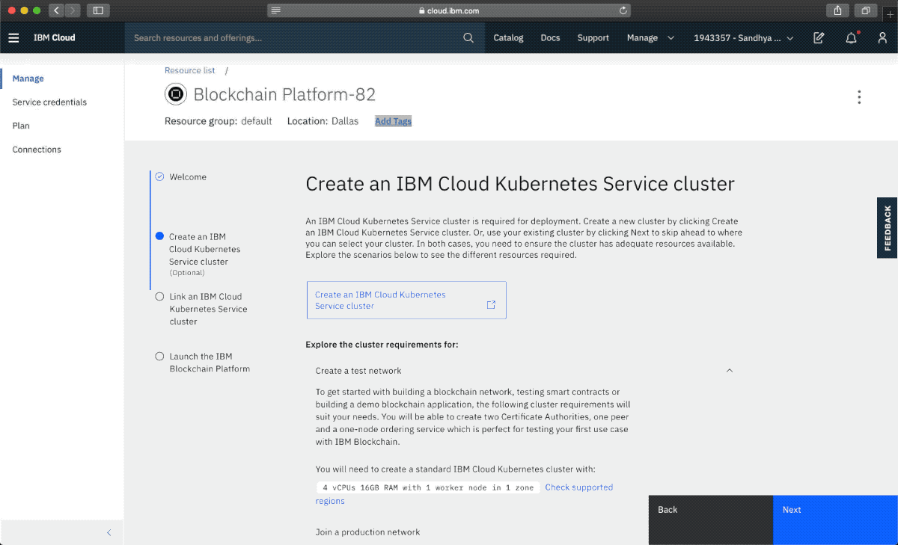
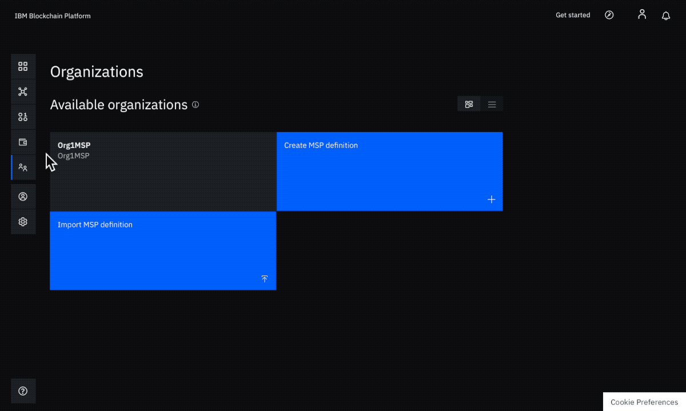
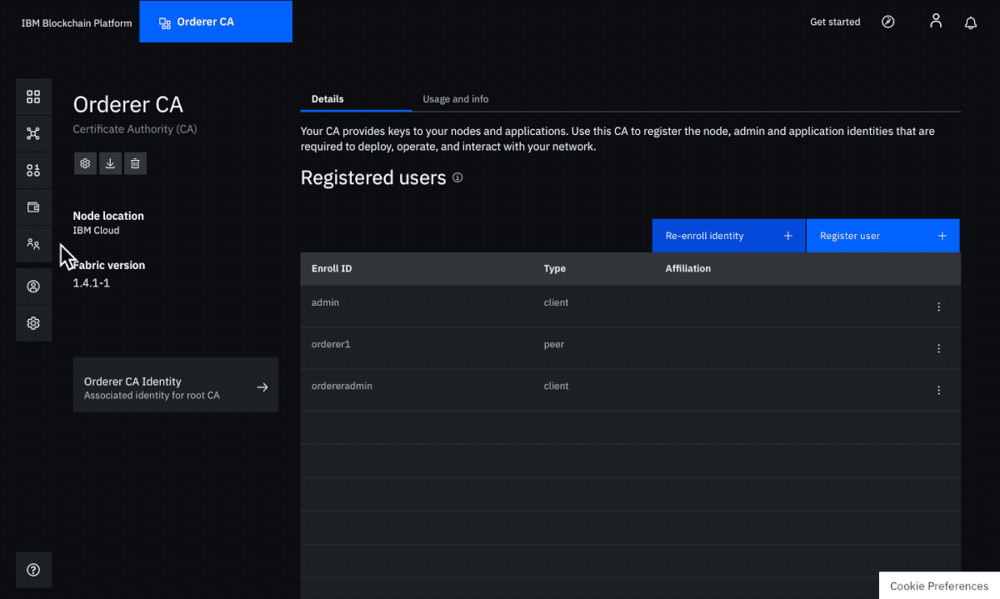
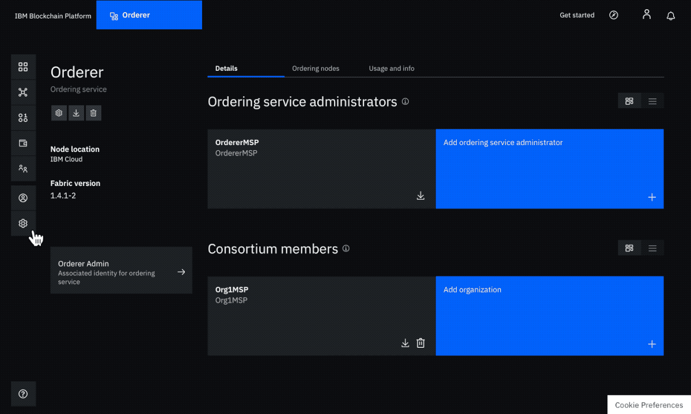
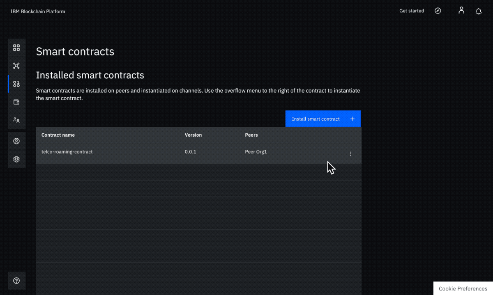

[](https://travis-ci.org/sandhya-nayak/Blockchain_for_TelcoRoaming_using_IBPV2)

# Blockchain_for_TelcoRoaming_using_IBPV2
In this code pattern, we will be deploying a telco roaming smart contract on a Hyperledger Fabric Network created on IBM Blockchain Platform. The smart contract governs the transactions between CSPs acting as home operators and roaming partners to track the activities of mobile users on the network enabling the direct exchange of information with transactions that are immutable and executed based on a consensus model using smart contract rules.

This business network includes: 

**SubscriberSims:** which represent a single (Mobile Station International Subscriber Directory Number). Simply said, each SubscriberSim represents a mobile number.

**CSPs:** or Communication Service Providers which can act as either the `Home Operator` of the SubscriberSim or the `Roaming Partner` of the SubscriberSim.

<p align="center">
  
</p>


There are four scenarios covered in this code pattern:

1. Roaming Subscriber Identification:<br/>
A SubscriberSim moves to a new location that is not a part of its home network. It is discovered as present in the *Roaming Partner's network* using the `discovery` function, authenticated as a Valid user using the `authentication` function and its calling rates are updated using the `updateRate` function.

2. Roaming Subscriber Billing:<br/>
Once the SubscriberSim has been authorized, it can make use of the Roaming Partner's network to initiate a call. `callOut` and `callEnd` functions can be used to initiate and end the call. The charges for network usage are instantaneously recorded between Home Operator and Roaming Partner based on their agreement as defined in the smart contract. `callPay` function is executed which calculates the charges for the call.

3. Fraud Identification:<br/>
A fraudulent SubscriberSim (with the same MSISDN as an existing SubscriberSim) is added. `authentication` function identifies the user as fraudulent and marks the SubscriberSim with isValid = Fraud in the ledger. This prevents the fraudulent SubscriberSim from initiating any calls.

4. Overage Management:<br/>
A roaming subscriber intiates a call. `callout` function is executed. The smart contract recognizes that the subscriber is potentially reaching the overage threshold. The operator notifies the subscriber about the reaching the overage threshold and specifies the potential tariff changes. The subscriber is asked to accept or deny the new charges, the subscriber's response is recorded in the ledger and future calls (including this one) are either initiated or denied based on whether the subscriber accepted or denied the overage charges. If the roaming subscriber accepted the charges, then all the future calls (including this one) will make use of the overageRate in order to calculate call charges instead of the roamingRate.


When you have completed this code pattern, you will understand how to:

1. Package a blockchain smart contract using the IBM Blockchain Platform Extension for VS Code.
2. Set up a Hyperledger Fabric network on IBM Blockchain Platform.
3. Install and instantiate a smart contract package through IBM Blockchain Platform.
4. Test the blockchain network by using NodeJS scripts that employ the Hyperledger Fabric SDK to interact with the deployed network by issuing transactions.

Audience level : Intermediate Developers

# Architecture flow

<p align="center">
  
</p>

1. The Blockchain Operator clones the GitHub repo to obtain the **Blockchain for Telco Roaming using IBPV2** smart contract.
2. The Blockchain Operator uses the IBM Blockchain Platform Extension for VS Code to package the smart contract.
3. The Blockchain Operator sets up and launches the IBM Blockchain Platform 2.0 service.
4. The IBM Blockchain Platform 2.0 enables the creation of a Hyperledger Fabric network onto a IBM Kubernetes Service, enabling installation and instantiation of the Blockchain for Telco Roaming using IBPV2 smart contract on the network.
5. The User can interact with the smart contract and run NodeJS scripts such as moveSim.js, callOut.js and callEnd.js which in turn use the Fabric SDK to interact with the deployed network on IBM Blockchain Platform 2.0 and issue transactions.


# Included components

*   [IBM Blockchain Platform 2.0](https://www.ibm.com/cloud/blockchain-platform) gives you total control of your blockchain network with a user interface that can simplify and accelerate your journey to deploy and manage blockchain components on the IBM Cloud Kubernetes Service.
*   [IBM Cloud Kubernetes Service](https://www.ibm.com/cloud/container-service) creates a cluster of compute hosts and deploys highly available containers. A Kubernetes cluster lets you securely manage the resources that you need to quickly deploy, update, and scale applications.
*   [IBM Blockchain Platform Extension for VS Code](https://marketplace.visualstudio.com/items?itemName=IBMBlockchain.ibm-blockchain-platform) is designed to assist users in developing, testing, and deploying smart contracts - including connecting to Hyperledger Fabric environments.


## Featured technologies

* [Node.js](https://nodejs.org/en/) is an open source, cross-platform JavaScript run-time environment that executes server-side JavaScript code.


## Prerequisites

* [IBM Cloud account](https://cloud.ibm.com/registration/?target=%2Fdashboard%2Fapps)
* [Node v8.x or greater and npm v5.x or greater](https://nodejs.org/en/download/)
* [VSCode version 1.26 or greater](https://code.visualstudio.com)
* [IBM Blockchain Platform Extension for VSCode](https://marketplace.visualstudio.com/items?itemName=IBMBlockchain.ibm-blockchain-platform)


# Running the application

Follow these steps to set up and run this code pattern. The steps are described in detail below.

## Steps

1. [Clone the repo](#1-clone-the-repo)
2. [Package the smart contract](#2-package-the-smart-contract)
3. [Create IBM Cloud services](#3-create-ibm-cloud-services)
4. [Build a network](#4-build-a-network)
5. [Deploy Blockchain for Telco Roaming using IBPV2 Smart Contract on the network](#5-deploy-blockchain-for-telco-roaming-using-ibpv2-smart-contract-on-the-network)
6. [Connect application to the network](#6-connect-application-to-the-network)
7. [Run the application](#7-run-the-application)


### 1. Clone the repo

Clone this repository in a folder your choice:

```
git clone https://github.com/IBM/Blockchain_for_TelcoRoaming_using_IBPV2.git
```

### 2. Package the smart contract

We will use the IBM Blockchain Platform extension on VS Code to package the smart contract.

* Open Visual Studio code and open the `contract` folder from `Blockchain_for_TelcoRoaming_using_IBPV2` repository that was cloned earlier. 
   **It is important that you are opening the `contract` folder and not the entire `Blockchain_for_TelcoRoaming_using_IBPV2` directory; otherwise you will see an error that states that it doesn't understand what programming language you are using.**

* Press the `F1` key to see the different VS code options. Choose `IBM Blockchain Platform: Package a Smart Contract Project`.

<p align="center">
  
</p>

* Click the `IBM Blockchain Platform` extension button on the left. This will show the packaged contracts on top and the blockchain connections on the bottom.

<p align="center">
  
</p>

* Next, right click on the packaged contract (in this case, select telcoroaming@0.0.1) to export it and choose `Export Package`.

* Choose a location on your machine and save the `.cds` file. We will use this packaged smart contract later to deploy on the IBM Blockchain Platform 2.0 service.

Now, we will start setting up and configuring our Hyperledger Fabric network on the IBM Cloud.

### 3. Create IBM Cloud services

* Create the [IBM Cloud Kubernetes Service](https://cloud.ibm.com/kubernetes/catalog/cluster). You can find the service in the `Catalog`. For this code pattern, we can use the `Free` cluster, and give it a name. Note, that the IBM Cloud allows one instance of a free cluster which expires after 30 days. **Note: it could take 20 minutes for the Kubernetes Service setup to complete**.

<br>
<p align="center">
  
</p>
<br>

* Create the [IBM Blockchain Platform 2.0](https://cloud.ibm.com/catalog/services/blockchain-platform) service on the IBM Cloud. You can find the service in the `Catalog`, and give it a name.

<br>
<p align="center">
  
</p>
<br>

* After your kubernetes cluster is up and running, you can deploy your IBM Blockchain Platform on the cluster. Again - wait for the Kubernetes service to indicate it was deployed. The IBM Blockchain Platform service walks through few steps and finds your cluster on the IBM Cloud to deploy the service on.

<br>
<p align="center">
  
</p>
<br>

* Once the Blockchain Platform is deployed on the Kubernetes cluster, you can launch the console to start configuring your blockchain network.

### 4. Build a network

We will build a network as provided by the IBM Blockchain Platform [documentation](https://cloud.ibm.com/docs/services/blockchain/howto?topic=blockchain-ibp-console-build-network#ibp-console-build-network). This will include creating a channel with a single peer organization with its own MSP and CA (Certificate Authority), and an orderer organization with its own MSP and CA. We will create the respective identities to deploy peers and operate nodes.

#### Create your peer organization CA
  - Navigate to the <b>Nodes</b> tab in the left navigation and click <b>Add Certificate Authority</b>.
  - Click <b>Create an IBM Cloud Certificate Authority</b> and <b>Next</b>.
  - Give it a <b>CA display name</b> of `Org1 CA` and click <b>Next</b>.
  - Specify an <b>CA Administrator Enroll ID</b> of `admin` and <b>CA Administrator Enroll Secret</b> of `adminpw`, then click <b>Next</b>.
  - Review the summary and click <b>Add Certificate Authority</b>.

<br>
<p align="center">
  
</p>
<br>


#### Use peer organization CA to register identities
  - Select the <b>Org1 CA</b> Certificate Authority that we created.
  - First, we will register an admin for our organization "org1". Click on the <b>Register User</b> button. Give an <b>Enroll ID</b> of `org1admin`, and <b>Enroll Secret</b> of `org1adminpw`. Set the <b>Type</b> for this identity as `client`. We can specify to <b>Use root affiliation</b> or uncheck this field and select from any of the affiliated organizations from the drop-down list. We will leave the <b>Maximum enrollments</b> field blank. Click <b>Next</b>.
  - We will not be adding any attributes to this user. Click <b>Register user</b>.
  - We will repeat the process to create an identity of the peer. Click on the <b>Register User</b> button. Give an <b>Enroll ID</b> of `peer1`, and <b>Enroll Secret</b> of `peer1pw`. Set the <b>Type</b> for this identity as `peer`. We can specify to <b>Use root affiliation</b> or uncheck this field and select from any of the affiliated organizations from the drop-down list. Click <b>Next</b>.
  - We will not be adding any attributes to this user. Click <b>Register user</b>.

<br>
<p align="center">
  
</p>
<br>


#### Create the peer organization MSP definition
  - Navigate to the <b>Organizations</b> tab in the left navigation and click <b>Create MSP definition</b>.
  - Enter the <b>MSP Display name</b> as `Org1MSP` and an <b>MSP ID</b> of `Org1MSP`.
  - Under <b>Root Certificate Authority</b> details, specify the peer CA that we created `Org1 CA` as the root CA for the organization.
  - Give the <b>Enroll ID</b> and <b>Enroll secret</b> for your organization admin, `org1admin` and `org1adminpw`. Then, give the Identity name as `Org1 Admin`.
  - Click the <b>Generate</b> button to enroll this identity as the admin of your organization and export the identity to the wallet. Click <b>Export</b> to export the admin certificates to your file system. Finally click <b>Create MSP definition</b>.

<br>
<p align="center">
  
</p>
<br>


#### Create a peer
  - Navigate to the <b>Nodes</b> tab in the left navigation and click <b>Add peer</b>.
  - Click <b>Create an IBM Cloud peer</b> and then click <b>Next</b>.
  - Give the <b>Peer display name</b> as `Peer Org1` and click <b>Next</b>.
  - On the next screen, select `Org1 CA` as the <b>Certificate Authority</b>. Then, give the <b>Peer enroll ID</b> and <b>Peer enroll secret</b> for the peer identity that you created for your peer, that is, `peer1`, and `peer1pw`. Select the <b>Organization MSP</b> as `Org1MSP`, from the drop-down list and click <b>Next</b>.
  - Give the <b>TLS CA enroll ID</b> as `admin`, and <b>TLS CA enroll secret</b> as `adminpw`; these same values were provided as the Enroll ID and Enroll secret when we created the CA. Leave the <b>TLS CSR hostname</b> blank. Click <b>Next</b>.
  - The next step is to Associate an identity with this peer to make it the admin of your peer. Select your peer admin identity `Org1 Admin` and click <b>Next</b>.
  - Review the summary and click <b>Add peer</b>.

<br>
<p align="center">
  
</p>
<br>


#### Create your orderer organization CA
  - Navigate to the <b>Nodes</b> tab in the left navigation and click <b>Add Certificate Authority</b>.
  - Click <b>Create an IBM Cloud Certificate Authority</b> and <b>Next</b>.
  - Give it a <b>CA display name</b> of `Orderer CA` and click <b>Next</b>.
  - Specify an <b>CA Administrator Enroll ID</b> of `admin` and <b>CA Administrator Enroll Secret</b> of `adminpw`, then click <b>Next</b>.
  - Review the summary and click <b>Add Certificate Authority</b>.

<br>
<p align="center">
  
</p>
<br>


#### Use orderer organization CA to register orderer and orderer admin identities
  - Select the <b>Orderer CA</b> Certificate Authority that we created.
  - First, we will register an admin for the "orderer" organization. Click on the <b>Register User</b> button. Give an <b>Enroll ID</b> of `ordereradmin`, and <b>Enroll Secret</b> of `ordereradminpw`. Set the <b>Type</b> for this identity as `client`. We can specify to <b>Use root affiliation</b> or uncheck this field and select from any of the affiliated organizations from the drop-down list. We will leave the <b>Maximum enrollments</b> field blank. Click <b>Next</b>.
  - We will not be adding any attributes to this user. Click <b>Register user</b>.
  - We will repeat the process to create an identity of the peer. Click on the <b>Register User</b> button. Give an <b>Enroll ID</b> of `orderer1`, and <b>Enroll Secret</b> of `orderer1pw`. Set the <b>Type</b> for this identity as `peer`. We can specify to <b>Use root affiliation</b> or uncheck this field and select from any of the affiliated organizations from the drop-down list. Click <b>Next</b>.
  - We will not be adding any attributes to this user. Click <b>Register user</b>.

<br>
<p align="center">
  
</p>
<br>


#### Create the orderer organization MSP definition
  - Navigate to the <b>Organizations</b> tab in the left navigation and click <b>Create MSP definition</b>.
  - Enter the <b>MSP Display name</b> as `OrdererMSP` and an <b>MSP ID</b> of `OrdererMSP`.
  - Under <b>Root Certificate Authority</b> details, specify the peer CA that we created `Orderer CA` as the root CA for the organization.
  - Give the <b>Enroll ID</b> and <b>Enroll secret</b> for your organization admin, `ordereradmin` and `ordereradminpw`. Then, give the Identity name as `Orderer Admin`.
  - Click the <b>Generate</b> button to enroll this identity as the admin of your organization and export the identity to the wallet. Click <b>Export</b> to export the admin certificates to your file system. Finally click <b>Create MSP definition</b>.

<br>
<p align="center">
  
</p>
<br>


#### Create an orderer
  
  - Navigate to the <b>Nodes</b> tab in the left navigation and click <b>Add ordering service</b>.
  - Click <b>Create an IBM Cloud Ordering service</b> and then click <b>Next</b>.
  - Give the <b>Ordering service display name</b> as `Orderer` and click <b>Next</b>.
  - On the next screen, select `Orderer CA` as the <b>Certificate Authority</b>. Then, give the <b>Ordering service enroll ID</b> and <b>Ordering service enroll secret</b> for the peer identity that you created for your orderer, that is, `orderer1`, and `orderer1pw`. Select the <b>Organization MSP</b> as `OrdererMSP`, from the drop-down list and click <b>Next</b>.
  - Give the <b>TLS CA enroll ID</b> as `admin`, and <b>TLS CA enroll secret</b> as `adminpw`; these same values were provided as the Enroll ID and Enroll secret when we created the CA. Leave the <b>TLS CSR hostname</b> blank. Click <b>Next</b>.
  - The next step is to Associate an identity with this peer to make it the admin of your peer. Select your peer admin identity `Orderer Admin` and click <b>Next</b>.
  - Review the summary and click <b>Add ordering service</b>.

<br>
<p align="center">
  
</p>
<br>


#### Add organization as Consortium Member on the orderer to transact
  - Navigate to the <b>Nodes</b> tab, and click on the <b>Orderer</b> that we created.
  - Under <b>Consortium Members</b>, click <b>Add organization</b>.
  - From the drop-down list, select `Org1MSP`, as this is the MSP that represents the peer's organization "Org1".
  - Click <b>Add organization</b>.

<br>
<p align="center">
  
</p>
<br>


#### Create the channel
  - Navigate to the <b>Channels</b> tab in the left navigation and click <b>Create channel</b>.
  - Give the <b>Channel name</b> as `mychannel`.
  - Select the orderer you created, `Orderer` from the <b>Ordering service</b> drop-down list.
  - Under <b>Organizations</b>, select `Org1MSP (Org1MSP)` from the drop-down list to add the organization "Org1" as a member of this channel. Click <b>Add</b> button. Set the permissions for this member as <b>Operator</b>.
  - Scroll down to the <b>Channel creator organization</b> section and select `Org1MSP (Org1MSP)` from the dropdown as the <b>Channel creator MSP</b> and select `Org1 Admin` from the dropdown under <b>Identity</b>.
  - Click <b>Create channel</b>.

<br>
<p align="center">
  
</p>
<br>


#### Join your peer to the channel
  - Click <b>Join channel</b> to add a peer to the channel.
  - Select your `Orderer` as the <b>Ordering service</b> and click <b>Next</b>.
  - Enter the name of the <b>Channel</b> as `mychannel` and click <b>Next</b>.
  - Next we need to select which peers should be added to the channel. In our case, we just want to add the peer we created under "Org1". Select `Peer Org1` .
  - Click <b>Join channel</b>.

<br>
<p align="center">
  
</p>
<br>


### 5. Deploy Blockchain for Telco Roaming using IBPV2 Smart Contract on the network

#### Install a smart contract
  - Navigate to the <b>Smart contracts</b> tab in the left navigation and click <b>Install smart contract</b>.
  - Browse to the location of the Blockchain for Telco Roaming using IBPV2 smart contract package file (it is probably named `telcoroaming@0.0.1.cds`), which we packaged earlier using the IBM Blockchain Platform extension for Visual Studio code.
  - Click on <b>Add file</b> and find your packaged smart contract. 
  - Once the contract is uploaded, click <b>Install smart contract</b>.

<br>
<p align="center">
  
</p>
<br>

#### Instantiate smart contract
  - Under <b>Installed smart contracts</b>, find the smart contract from the list (**Note: ours is called telcoroaming**) installed on our peer and click <b>Instantiate</b> from the overflow menu on the right side of the row.
  - On the side panel that opens, select the channel, `mychannel`  on which to instantiate the smart contract. Click <b>Next</b>.
  - Select the organization members to be included in the endorsement policy. In our case, we need to select `Org1MSP`. Click <b>Next</b>.
  - We can skip the <b>Setup private data collection</b> step and simply click <b>Next</b>.
  - Leave the <b>Function name</b> and <b>Arguments</b> blank.
  - Click <b>Instantiate</b>.

<br>
<p align="center">
  
</p>
<br>

## 6. Connect application to the network

#### Connect with sdk through connection profile
  - Scroll down to the <b>Instantiated smart contracts</b> section and find the "telcoroaming" contract in the list. Click on `Connect with SDK` from the overflow menu on the right side of the row.
  - From the dropdown for <b>MSP for connection</b> choose `Org1MSP`.
  - From the dropdown for <b>Certificate Authority</b> choose `Org1 CA`.
  - Download the connection profile by scrolling down and clicking <b>Download Connection Profile</b>. This will download the connection json which we will use to establish a connection between the Node.js web application and the Blockchain Network.
  - You can click <b>Close</b> once the download completes.

<br>
<p align="center">
  
</p>
<br>

#### Create an application admin
  - Navigate to the <b>Nodes</b> tab in the left navigation, and under <b>Certificate Authorities</b>, choose your organization CA, <b>Org1 CA</b>.
  - Click on <b>Register user</b>.
  - Give an <b>Enroll ID</b> of `app-admin` and <b>Enroll Secret</b> of `app-adminpw`. Set the <b>Type</b> for this identity as `client`. We can specify to <b>Use root affiliation</b> or uncheck this field and select from any of the affiliated organizations from the drop-down list. We will leave the <b>Maximum enrollments</b> field blank. Click <b>Next</b>.
  - Under <b>Attributes</b>, click on <b>Add attribute</b>. Give attribute as `hf.Registrar.Roles` = `*`. This will allow this identity to act as a registrar and issue identities for our app. Click <b>Add-attribute</b>.
  - Click <b>Register</b>.

<br>
<p align="center">
  
</p>
<br>


#### Update application connection profile
  - Copy the connection profile you downloaded into the [fabric folder](web-app/controller/restapi/features/fabric).
  - Update the [config.json](web-app/controller/restapi/features/fabric/config.json) file with:
    - The connection json file name you downloaded.
    - The <b>enroll id</b> and <b>enroll secret</b> for your app admin, which we earlier provided as `app-admin` and `app-adminpw` respectively.
    - The orgMSP ID, which we provided as `Org1MSP`.
    - The caName, which can be found in your connection json file under "organization" -> "Org1MSP" -> certificateAuthorities". This would be like an IP address and a port.
    - The peerName, which can be found in your connection json file under "organization" -> "Org1MSP" -> peers". This would be like an IP address and a port.
    - The ordererName, which can be found in your connection json file under "orderers". This would be like an IP address and a port.
    - Update gateway discovery to `{ enabled: true, asLocalhost: false }` to connect to IBM Blockchain Platform.

```bash
 {
    "channel_name": "mychannel",
    "smart_contract_name": "telco-roaming-contract",
    "connection_file": "mychannel_telco-roaming-contract_profile.json",
    "appAdmin": "app-admin",
    "appAdminSecret": "app-adminpw",
    "orgMSPID": "Org1MSP",
    "caName": "184.172.229.220:31844",
    "peerName": "184.172.229.220:30884",
    "ordererName": "184.172.229.220:32685",
    "gatewayDiscovery": { "enabled": true, "asLocalhost": false }
 }
```


### 7. Run the application

#### In a new terminal, navigate to the [`application`](application) directory:

  ```bash
  cd Blockchain_for_TelcoRoaming_using_IBPV2/application/
  ```

#### Build the node dependencies:

  ```bash
  npm install
  ```
  
#### Enroll the admin and add identity to the wallet:
  
  **Note: This creates public and private key files for the app-admin in the _idwallet folder inside the [fabric folder](application/fabric). If a folder named "app-admin" exists in the "_idwallet" folder, then the following command will not enroll the app-admin as it already exists in the wallet. Remove the app-admin folder and then run the following command.**
  
  ```bash
  node enrollAdmin.js
  ```

#### Run the application:


1. Set up the CSPs and SubscriberSims

  ```bash
  node createCSPAndSim.js
  ```
  
  **Output:**
  
  ```bash
  Sending transaction proposal for createCSP with transaction id 8cea5159d5f4aff59189469b38c2ec4a6d310277e2af3e643453ed028ac6d050
  Transaction proposal was good
  Successfully sent Proposal and received ProposalResponse: Status - 200, message - ""
  Created Promise - createCSP for CSP_US
  Found CreateCSPEvent
  Sending transaction proposal for createCSP with transaction id 28cb8b7b9fe2cc86140c2578541394e02a695ca8a4504361e856e4bd2edce462
  Transaction proposal was good
  Successfully sent Proposal and received ProposalResponse: Status - 200, message - ""
  Created Promise - createCSP for CSP_EU
  Found CreateCSPEvent
  Sending transaction proposal for createSubscriberSim with transaction id 930be8c845bdf45c3e57e100fcbc9d8719015c28456f05aebc5e5203b447517d
  Transaction proposal was good
  Successfully sent Proposal and received ProposalResponse: Status - 200, message - ""
  Created Promise - createSubscriberSim for sim1
  Found CreateSubscriberSimEvent
  Sending transaction proposal for createSubscriberSim with transaction id fac80e05e6caad261a6e15129c0a980adc4ef3c008417d7bc9679dc8a8bb1e8a
  Transaction proposal was good
  Successfully sent Proposal and received ProposalResponse: Status - 200, message - ""
  Created Promise - createSubscriberSim for sim2
  Found CreateSubscriberSimEvent
  Sending transaction proposal for authentication with transaction id 956a9bc0f4934cbfedf0c1501838aa0b3eee3e32dc9744735accb9e5cf2c1ca6
  Transaction proposal was good
  Successfully sent Proposal and received ProposalResponse: Status - 200, message - ""
  Created Promise - authentication for sim1
  Found AuthenticationEvent
  Sending transaction proposal for authentication with transaction id bbc6a04ff4fbfe47d8636d34775fc3cff17169d92211e69446a7d755af17bba1
  Transaction proposal was good
  Successfully sent Proposal and received ProposalResponse: Status - 200, message - ""
  Created Promise - authentication for sim2
  Found AuthenticationEvent
  ```
  
2. Move sims to new locations outside their Home Operator's coverage areas

  **Move sim1 to European Union**
  
  ```bash
  node moveSim.js sim1 European\ Union
  ```
  
  **Output**
  
  ```bash
  Sending transaction proposal for moveSim with transaction id 873447b7456e7521b98d691487221d8121634253ad39abeb3a6b82c0b9e56403
  Transaction proposal was good
  Successfully sent Proposal and received ProposalResponse: Status - 200, message - ""
  Created Promise - moveSim for sim1
  Found MoveEvent
  Sending transaction proposal for discovery with transaction id 135fcaad963091208778f63ff353dd37a71edada088afbeb66d9795fc0dcfd5a
  Transaction proposal was good
  Successfully sent Proposal and received ProposalResponse: Status - 200, message - ""
  Created Promise - discovery for sim1
  Found discovery event
  Sending transaction proposal for authentication with transaction id 5ed86939f03270d38abaa0e2586444485c902a235cb70a8634a2e11ebb802fe9
  Transaction proposal was good
  Successfully sent Proposal and received ProposalResponse: Status - 200, message - ""
  Created Promise - authentication for sim1
  Found authentication event
  Sending transaction proposal for updateRate with transaction id 1205dc1019ceecc39a844bf68dcc7b2fba88bc0c7e3441a4445b12c08d8dc9ce
  Transaction proposal was good
  Successfully sent Proposal and received ProposalResponse: Status - 200, message - ""
  Created Promise - updateRate for sim1
  Found updateRate event
  ```
  
  **Move sim2 to United States**
  
  ```bash
  node moveSim.js sim2 United\ States
  ```
  
  **Output**
  
  ```bash
  Sending transaction proposal for moveSim with transaction id 82431f50b5534f51ae8a5d4a7f32709e3ca107c57f57f8eedc1149fcdbe1f627
  Transaction proposal was good
  Successfully sent Proposal and received ProposalResponse: Status - 200, message - ""
  Created Promise - moveSim for sim2
  Found MoveEvent
  Sending transaction proposal for discovery with transaction id 670e70c77c8a19bfc93bd4ceb3a8abe094ce698c7d8c82c7f70b0cba756fdbd7
  Transaction proposal was good
  Successfully sent Proposal and received ProposalResponse: Status - 200, message - ""
  Created Promise - discovery for sim2
  Found discovery event
  Sending transaction proposal for authentication with transaction id 07d8f123d49ab8da1f9418e72c343e3fa71a39ddb635a0c16ec38b2281cdf88b
  Transaction proposal was good
  Successfully sent Proposal and received ProposalResponse: Status - 200, message - ""
  Created Promise - authentication for sim2
  Found authentication event
  Sending transaction proposal for updateRate with transaction id 0efbb2358510212c9d95c966a65acbb848c37848c04616fa974210682d9640e7
  Transaction proposal was good
  Successfully sent Proposal and received ProposalResponse: Status - 200, message - ""
  Created Promise - updateRate for sim2
  Found updateRate event
  ```

3. Initiate and end calls. Also simulate overage scenario.

Run callOut.js for sim1 to initiate a call. Run callEnd.js for sim1 to end the call. Repeat these until the overage limit is reached. Two quick calls should be enough -> callOut, callEnd, callOut, callEnd. Once the overage limit is reached, the next callOut.js will cause a prompt to appear on the terminal which indicates that the sim has reached the overage limit and all future calls (including this one) will be charged at a higher rate. Select "Yes" to accept the charges and the call will be initiated. The user's response of "Yes" will be saved in the ledger (as sim1.allowOverage="true") and future runs of callOut will simply initiate calls with the higher charges.
We will repeat the same process for sim2, however, once the overage limit is reached and the prompt is displayed, we will select "No" in order to deny the charges. This causes the user's response of "No" to be saved in the ledger as sim2.allowOverage=false, and as a result, this as well as all future calls will not be initiated. As in case of sim1, since the response has been stored in the ledger, the prompt will not be displayed the next time callOut.js is run.

  **Perform callOut and callEnd on sim1 until overageLimit is reached**
  
  
  ```bash
  node callOut.js sim1
  ```
  
  **Output**
  
  ```bash
  Sending transaction proposal for verifyUser with transaction id e5544bdc43cf06c731378ac33f27c586a4581628cbb38bb07aa36f3d486286e8
  Transaction proposal was good
  Successfully sent Proposal and received ProposalResponse: Status - 200, message - ""
  Created Promise - verifyUser for sim1
  Found VerifyUserEvent
  Sending transaction proposal for setOverageFlag with transaction id ea14f1e50a8789b02b8b6ce7d9c7fcbc02e7ccc8f38e5db04eea3b234ab477fd
  Transaction proposal was good
  Successfully sent Proposal and received ProposalResponse: Status - 200, message - ""
  Created Promise - setOverageFlag for sim1
  Found SetOverageFlagEvent
  Sending transaction proposal for callOut with transaction id e51bd3fbcfd0de69a619754a54353a203f15ba1b5276bd33b33e9c489b8d8add
  Transaction proposal was good
  Successfully sent Proposal and received ProposalResponse: Status - 200, message - ""
  Created Promise - callOut for sim1
  Found CallOutEvent
  ```
  
  ```bash
  node callEnd.js sim1
  ```
  
  **Output**
  
  ```bash
  Sending transaction proposal for callEnd with transaction id d3cfb96e20e6a3a689202bb9169e67e0df65b319c30c2504bf7352139e91cc3e
  Transaction proposal was good
  Successfully sent Proposal and received ProposalResponse: Status - 200, message - ""
  Created Promise - callEnd for sim1
  Found CallEndEvent
  Sending transaction proposal for callPay with transaction id 48eda03372377f1a9538ee07b02e7c9866119a4817e34479a3e33929bb2e8c6d
  Transaction proposal was good
  Successfully sent Proposal and received ProposalResponse: Status - 200, message - ""
  Created Promise - callPay for sim1
  Found CallPayEvent
  ```
  
  **Perform callOut and callEnd on sim1 after overageLimit is reached**
  
  ```bash
  node callOut.js sim1
  ```
  
  **Output**
  
  ```bash
  Sending transaction proposal for verifyUser with transaction id 8cc7d67a2a861df7165ef6be2b1c70d3ba23b4093a61967d9b472a71f438841b
  Transaction proposal was good
  Successfully sent Proposal and received ProposalResponse: Status - 200, message - ""
  Created Promise - verifyUser for sim1
  Found VerifyUserEvent
  ✔ The user is nearing overage limits. This call and all futher calls may incur additional charges. Do you accept? › Yes
  Sending transaction proposal for setOverageFlag with transaction id 717c069325f4223b0ab4f80accfcd41b0c0048d53feacbadb6242ffbbd57c8be
  Transaction proposal was good
  Successfully sent Proposal and received ProposalResponse: Status - 200, message - ""
  Created Promise - setOverageFlag for sim1
  Found SetOverageFlagEvent
  Sending transaction proposal for callOut with transaction id 2bca151fc57623cb3dddca02a794484ca9a9dbe26bb2bb5fa6ef34bced65d5db
  Transaction proposal was good
  Successfully sent Proposal and received ProposalResponse: Status - 200, message - ""
  Created Promise - callOut for sim1
  Found CallOutEvent
  ```
  
  ```bash
  node callEnd.js sim1
  ```
  
  **Output**
  
  ```bash
  Sending transaction proposal for callEnd with transaction id 9ce6f43d937e5c28e30173e2b42734a30bd1492ff9143f7bc6d902aab9e5d8a5
  Transaction proposal was good
  Successfully sent Proposal and received ProposalResponse: Status - 200, message - ""
  Created Promise - callEnd for sim1
  Found CallEndEvent
  Sending transaction proposal for callPay with transaction id 8ffa9b330e0473cdaac2fe2c7a425eeb8bfc10c906390da80d2b0e70bb293950
  Transaction proposal was good
  Successfully sent Proposal and received ProposalResponse: Status - 200, message - ""
  Created Promise - callPay for sim1
  Found CallPayEvent
  ```
  
  **Perform callOut and callEnd on sim2 until overageLimit is reached**
  
  ```bash
  node callOut.js sim2
  ```
  
  **Output**
  
  ```bash
  Sending transaction proposal for verifyUser with transaction id e4648aed8e5a0e11820b3b5332cefc41e112cc043b3bfb51bd258ff2c461dbe9
  Transaction proposal was good
  Successfully sent Proposal and received ProposalResponse: Status - 200, message - ""
  Created Promise - verifyUser for sim2
  Found VerifyUserEvent
  Sending transaction proposal for setOverageFlag with transaction id f22859c45c8cf8154c2a4da63ff7b2a27fb0bc4750e23ca77363159defc15798
  Transaction proposal was good
  Successfully sent Proposal and received ProposalResponse: Status - 200, message - ""
  Created Promise - setOverageFlag for sim2
  Found SetOverageFlagEvent
  Sending transaction proposal for callOut with transaction id 61ea3c5b5615b86ce8d9889cb80be1d1b66b2a2dbe6df0c209fc09f94bbc8ea9
  Transaction proposal was good
  Successfully sent Proposal and received ProposalResponse: Status - 200, message - ""
  Created Promise - callOut for sim2
  Found CallOutEvent
  ```
  
  ```bash
  node callEnd.js sim2
  ```

  **Output**
  
  ```bash
  Sending transaction proposal for callEnd with transaction id b2a03c620d5a8baa5bf633a1f475a1e445a8acf4122b1b8b6c2d9e538362be63
  Transaction proposal was good
  Successfully sent Proposal and received ProposalResponse: Status - 200, message - ""
  Created Promise - callEnd for sim2
  Found CallEndEvent
  Sending transaction proposal for callPay with transaction id b1d97d2563f491c915ff04f45622637687728e101936fc2aef2120e305141d9c
  Transaction proposal was good
  Successfully sent Proposal and received ProposalResponse: Status - 200, message - ""
  Created Promise - callPay for sim2
  Found CallPayEvent
  ```
  
  **Perform callOut on sim2 after overageLimit is reached**
  
  ```bash
  node callOut.js sim2
  ```
  
  **Output**
  
  ```bash
  Sending transaction proposal for verifyUser with transaction id ad4975ea88faf0e1ebe3482a1f0a0a215c62baeed978e938383269bf3f2a8c85
  Transaction proposal was good
  Successfully sent Proposal and received ProposalResponse: Status - 200, message - ""
  Created Promise - verifyUser for sim2
  Found VerifyUserEvent
  ✔ The user is nearing overage limits. This call and all futher calls may incur additional charges. Do you accept? › No
  Sending transaction proposal for setOverageFlag with transaction id 00d2a3a40c0cebf45f4b5962a954ba919120a5f48a48360bccefaa98af01fe11
  Transaction proposal was good
  Successfully sent Proposal and received ProposalResponse: Status - 200, message - ""
  Created Promise - setOverageFlag for sim2
  Found SetOverageFlagEvent
  Sending transaction proposal for callOut with transaction id 4f49a2e452e31744b034b84832632b70cdd01542345ceb07417d68c66238dd5d
  2019-09-19T18:51:02.923Z - warn: [DiscoveryEndorsementHandler]: _build_endorse_group_member >> G0:0 - endorsement failed - Error: transaction returned with failure: Error: No further calls will be allowed as the user sim2 has reached the overage threshold and has denied the overage charges.
  An unhandled rejection was found -  Endorsement has failed
  ```
  
  ```bash
  node callOut.js sim2
  ```
  
  **Output**
  
  ```bash
  Sending transaction proposal for verifyUser with transaction id ceb8b68d5966f4158c1f39b07536e3a62b82332f1472eac18ebbdb52ec72b22e
  Transaction proposal was good
  Successfully sent Proposal and received ProposalResponse: Status - 200, message - ""
  Created Promise - verifyUser for sim2
  Found VerifyUserEvent
  Sending transaction proposal for setOverageFlag with transaction id 7c769435277ae2a055cd205730bae03bcdf07515187dd927d92ea89974e5b6d0
  Transaction proposal was good
  Successfully sent Proposal and received ProposalResponse: Status - 200, message - ""
  Created Promise - setOverageFlag for sim2
  Found SetOverageFlagEvent
  Sending transaction proposal for callOut with transaction id 9f2ab913736337c23ac65baaaa3844416b66e6a08feafe3ce8917db8b176a70e
  2019-09-19T18:51:15.519Z - warn: [DiscoveryEndorsementHandler]: _build_endorse_group_member >> G0:0 - endorsement failed - Error: transaction returned with failure: Error: No further calls will be allowed as the user sim2 has reached the overage threshold and has denied the overage charges.
  An unhandled rejection was found -  Endorsement has failed
  ```
  
4. Simulate fraud user scenario.

  **Create fraud user**

  ```bash
  node createFraudUser.js
  ```
  
  **Output**
  
  ```bash
  Sending transaction proposal for createSubscriberSim with transaction id 18a2b40e4445f12d5b1b77ff92d3ad3b166c3ca9e0679d3d9206e1968e27c27c
  Transaction proposal was good
  Successfully sent Proposal and received ProposalResponse: Status - 200, message - ""
  Created Promise - createSubscriberSim for sim3
  Found CreateSubscriberSimEvent
  Sending transaction proposal for authentication with transaction id 12693458eeee989a74311b95be0df598a33f77f89ae39964802982b778733654
  Transaction proposal was good
  Successfully sent Proposal and received ProposalResponse: Status - 200, message - ""
  Created Promise - authentication for sim3
  Found AuthenticationEvent
  ```
  
  **Move fraud user to European Union**
  
  ```bash
  node moveSim.js sim3 European\ Union
  ```
  
  **Output**
  
  ```bash
  Sending transaction proposal for moveSim with transaction id 1fde8df1d120c9830f1f90da2a35772e30659fa91beb90657865530a55df4d6f
  Transaction proposal was good
  Successfully sent Proposal and received ProposalResponse: Status - 200, message - ""
  Created Promise - moveSim for sim3
  Found MoveEvent
  Sending transaction proposal for discovery with transaction id abdccf82b45d31bdf917a15c894f809b75db1a77292ee3915b07f71371c8e524
  Transaction proposal was good
  Successfully sent Proposal and received ProposalResponse: Status - 200, message - ""
  Created Promise - discovery for sim3
  Found discovery event
  Sending transaction proposal for authentication with transaction id 7995fa4737684f9623649327aacc4ec62030084d7777f7596bf0e1162d4d0326
  Transaction proposal was good
  Successfully sent Proposal and received ProposalResponse: Status - 200, message - ""
  Created Promise - authentication for sim3
  Found authentication event
  Sending transaction proposal for updateRate with transaction id eda9da745eed8c812633cd1ed726d0a4566b1e44088da1699e6991702ad5b887
  2019-09-19T18:44:05.356Z - warn: [DiscoveryEndorsementHandler]: _build_endorse_group_member >> G0:0 - endorsement failed - Error: transaction returned with failure: Error: This user sim3 has been marked as fraudulent because the msisdn specified by this user is already in use. No calls can be made by this user.
  An unhandled rejection was found -  Endorsement has failed
  ```
  
  **Initiate a call for fraud user**
  
  ```bash
  node callOut.js sim3
  ```

  **Output**
  
  ```bash
  Sending transaction proposal for verifyUser with transaction id bb93d56cad036df8155f040c5c0791b7f08b3c68bf0ad782977369d420f23392
  2019-09-19T18:44:24.102Z - warn: [DiscoveryEndorsementHandler]: _build_endorse_group_member >> G0:0 - endorsement failed - Error: transaction returned with failure: Error: This user sim3 has been marked as fraudulent because the msisdn specified by this user is already in use. No calls can be made by this user.
  An unhandled rejection was found -  Endorsement has failed
  ```
  
  
# Links
* [Hyperledger Fabric Docs](http://hyperledger-fabric.readthedocs.io/en/latest/)
* [IBM Code Patterns for Blockchain](https://developer.ibm.com/patterns/category/blockchain/)


# License
This code pattern is licensed under the Apache Software License, Version 2. Separate third-party code objects invoked within this code pattern are licensed by their respective providers pursuant to their own separate licenses. Contributions are subject to the [Developer Certificate of Origin, Version 1.1 (DCO)](https://developercertificate.org/) and the [Apache Software License, Version 2](https://www.apache.org/licenses/LICENSE-2.0.txt).

[Apache Software License (ASL) FAQ](https://www.apache.org/foundation/license-faq.html#WhatDoesItMEAN)
